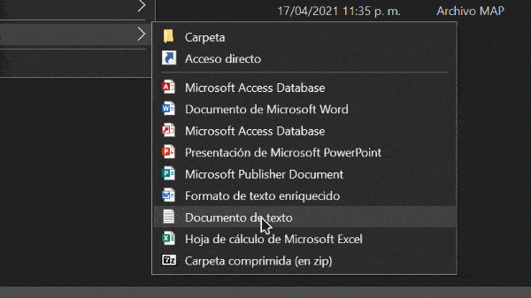

# Google forms auto fill
## Description
I have this online course where we have to fill a Google form for attendance records every day, and it has been really annoying to input the same data over and over. I’ve made a script that automatically fills in the Google form for me and send it.

## Dependencies
- Puppeteer 8.0.0

## Installation
`npm install`

## Modify `index.ts`
Change this string to the URL of your Google form
```typescript
const formURL: string = "https://docs.google.com/forms/d/e/1FAIpQLSe19oQwJlazDrHxGq4jrHa1ek6htjDY5pyi-wz1sXHLeJrw0A/viewform";
```
> The student object contains the information we are going to send to the Google form

Change the `name` & `id` 
```typescript
  const student = {
    name: "Dubón Lémus Carlos Daniel",
    id: "201943354",
  };
```

## Build
`npx tsc -b`

This will generate a `index.js` script under the `dist` folder that you can run with *Node.js*

## Usage

`node index.js`

## Creating a `.bat` file
- Create a new `.txt` file in the folder where `index.js` is located
- Rename and change the extension of `*.txt` to `script.bat`
- Edit the file in a text editor
- Write `node index.js` and save the file



# License
[MIT](https://github.com/carlos-dubon/google-forms-auto-fill/blob/main/LICENSE)
